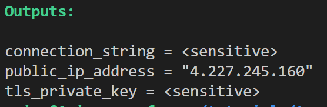

## Section 1: Terraform Setup (~6 minutes)

In Section 1, we start with setting up our infrastructure using Terraform. Terraform is an Infrastructure as Code (IaC) tool that enables you to define, provision, and manage cloud resources declaratively using configuration files. With Terraform, you can automate the creation and management of resources, making it an efficient and consistent way to deploy and maintain infrastructure. We'll use Terraform to create an Azure Virtual Machine, configure a Virtual Network with associated subnets, and set up an Azure Service Bus featuring private endpoint connectivity. Upon completing this section, you'll possess a thorough understanding of how to leverage Terraform for the creation and management of Azure resources, facilitating secure messaging between applications.

### Configure the Azure provider 

In a terminal at the root of this repository, navigate to /terraform. The code for all of our infrastructure will be held here.

```
cd terraform/ 
```
Open the blank `main.tf` in your code editor of choice and paste the following code block. This sets up our terraform code to use the Azure terraform provider via the azure cli configured in the prerequisites. 

``` HCL
terraform {
  required_providers {
    azurerm = {
      source  = "hashicorp/azurerm"
    }
  }
}

provider "azurerm" {
  features {}
}
```

### Create the networking infastructure 

Now that our provider is setup, We'll start by creating the essential networking resources we'll need to get our virtual machine running and secure: 

- Virtual Network
- Subnet
- Network interface
- Public IP 
- Security Group
- Network interface association

Begin by adding the provided code to your main.tf file.

``` HCL

resource "azurerm_resource_group" "tutorial_resourcegroup" {
  name     = "tutorial-resourcegroup"
  location = "East US"
}

resource "azurerm_virtual_network" "tutorial_vnet" {
  name                = "tutorial-vnet"
  address_space       = ["10.0.0.0/16"]
  location            = azurerm_resource_group.tutorial_resourcegroup.location
  resource_group_name = azurerm_resource_group.tutorial_resourcegroup.name
}

resource "azurerm_subnet" "tutorial_subnet" {
  name                 = "tutorial-subnet"
  resource_group_name  = azurerm_resource_group.tutorial_resourcegroup.name
  virtual_network_name = azurerm_virtual_network.tutorial_vnet.name
  address_prefixes     = ["10.0.1.0/24"]
}

resource "azurerm_public_ip" "tutorial_public_ip" {
  name                = "tutorial_public_ip"
  location            = azurerm_resource_group.tutorial_resourcegroup.location
  resource_group_name = azurerm_resource_group.tutorial_resourcegroup.name
  allocation_method   = "Dynamic"
}

resource "azurerm_network_interface" "tutorial_nic" {
  name                = "tutorial-nic"
  location            = azurerm_resource_group.tutorial_resourcegroup.location
  resource_group_name = azurerm_resource_group.tutorial_resourcegroup.name

  ip_configuration {
    name                          = "internal"
    subnet_id                     = azurerm_subnet.tutorial_subnet.id
    private_ip_address_allocation = "Dynamic"
    public_ip_address_id          = azurerm_public_ip.tutorial_public_ip.id

  }
}
resource "azurerm_network_security_group" "tutorial_networksg" {
  name                = "tutorial-networksg"
  location            = azurerm_resource_group.tutorial_resourcegroup.location
  resource_group_name = azurerm_resource_group.tutorial_resourcegroup.name

  security_rule {
    name                       = "SSH"
    priority                   = 1001
    direction                  = "Inbound"
    access                     = "Allow"
    protocol                   = "Tcp"
    source_port_range          = "*"
    destination_port_range     = "22"
    source_address_prefix      = "*"
    destination_address_prefix = "*"
  }
}

resource "azurerm_network_interface_security_group_association" "example" {
  network_interface_id      = azurerm_network_interface.tutorial_nic.id
  network_security_group_id = azurerm_network_security_group.tutorial_networksg.id
} 
```

Looking at the code, we can see that we setup virtual network and subnet to exist on private IPs to ensure we can control the the flow of traffic. However, we do create a way for us to access our eventual VM by creating a public IP and security group rules that allow for SSH access. 


### Create the VM 

Next, configure the virtual machine.

``` HCL 
resource "azurerm_linux_virtual_machine" "tutorial_vm" {
  name                  = "tutorial-vm"
  location              = azurerm_resource_group.tutorial_resourcegroup.location
  resource_group_name   = azurerm_resource_group.tutorial_resourcegroup.name
  network_interface_ids = [azurerm_network_interface.tutorial_nic.id]
  size                  = "Standard_F2"
  admin_username        = "tutorialuser"
  computer_name         = "tutorial-vm"
  disable_password_authentication = true

  source_image_reference {
    publisher = "Canonical"
    offer     = "UbuntuServer"
    sku       = "18.04-LTS"
    version   = "latest"
  }

  os_disk {
     caching              = "ReadWrite"
    storage_account_type = "Standard_LRS"
  }

  admin_ssh_key {
    username   = "tutorialuser"
    public_key = tls_private_key.tutorial_ssh.public_key_openssh
  }

}
```

### Service Bus Infastructure 

At this point our `main.tf` file has the code needed to create a VM within a private network and subnet. It's time to setup the Service Bus that'll be receiving our messages. There's a few  key components to the Azure Service Bus that we'll be utilizing:  

- **Namespace:** A serverless instance of the service bus that can contain queues and topics under a shared acess/logging/monitoring policy. 
- **Topics:** These provide a space to send and recieve messages in publish/subscribe messaging patterns. Applications transmit messages to topics. 
- **Subscription:** Subscriptions attach to topics and allow applications to asynchronously recieve messages that show up in them.
  
``` HCL
resource "azurerm_servicebus_namespace" "tutorial_sbus_namespace" {
  name                = "tutorials-bus-namespace"
  location            = azurerm_resource_group.tutorial_resourcegroup.location
  resource_group_name = azurerm_resource_group.tutorial_resourcegroup.name
  sku                 = "Premium"
  capacity            = 1
  public_network_access_enabled = false
}

resource "azurerm_servicebus_topic" "tutorial_topic" {
  name                = "tutorial-topic"
  namespace_id        = azurerm_servicebus_namespace.tutorial_sbus_namespace.id
}

resource "azurerm_servicebus_subscription" "tutorial_subscription" {
  name                = "tutorial-subscription"
  topic_id         = azurerm_servicebus_topic.tutorial_topic.id
  max_delivery_count = 10
}
``` 

The code above creates our namespace as `Premium` to allow us to create private endpoints, and disables public network access to keep our service bus from communicating across internet. 

### Configure Private Endpoint

Since we disabled public network access to our service bus, we have to build a communication channel to our private subnet from scratch. We accomplish that through a private endpoint and a new DNS record that'll link to that endpoint.

``` HCL
resource "azurerm_private_endpoint" "tutorial_private_endpoint" {
  name                = "tutorial_private_endpoint"
  location            = azurerm_resource_group.tutorial_resourcegroup.location
  resource_group_name = azurerm_resource_group.tutorial_resourcegroup.name
  subnet_id           = azurerm_subnet.tutorial_subnet.id

  private_service_connection {
    name                           = "tutorial_private_service_connection"
    private_connection_resource_id = azurerm_servicebus_namespace.tutorial_sbus_namespace.id
    subresource_names              = ["namespace"]
    is_manual_connection           = false
  }
}

resource "azurerm_private_dns_zone" "tutorial_priv_dns_zone" {
  name                = "privatelink.servicebus.windows.net"
  resource_group_name = azurerm_resource_group.tutorial_resourcegroup.name
}

resource "azurerm_private_dns_zone_virtual_network_link" "tutorial_dns_link" {
  name                  = "tutorial-dns-link"
  resource_group_name   = azurerm_resource_group.tutorial_resourcegroup.name
  private_dns_zone_name = azurerm_private_dns_zone.tutorial_priv_dns_zone.name
  virtual_network_id    = azurerm_virtual_network.tutorial_vnet.id
  registration_enabled  = false
}

resource "azurerm_private_dns_a_record" "tutorial_private_dns_a_record" {
  name                = azurerm_servicebus_namespace.tutorial_sbus_namespace.name
  zone_name           = azurerm_private_dns_zone.tutorial_priv_dns_zone.name
  resource_group_name = azurerm_resource_group.tutorial_resourcegroup.name
  ttl                 = 300
  records             = [azurerm_private_endpoint.tutorial_private_endpoint.private_service_connection[0].private_ip_address]
}
```

In the code above, we setup a private endpoint within the subnet we created at the start. THe `private_service_connection` block then connects it to the Azure Service Bus namespace.  Then, we create a few DNS resources that allow the virtual network to resolve a new FQDN ( Fully qualified domain name ) that we give to namespace.

### Outputs

As the final part of our `main.tf` file, we create some outputs that'll help us with the next steps.

``` HCL
output "public_ip_address" {
  value = azurerm_linux_virtual_machine.tutorial_vm.public_ip_address
}

output "tls_private_key" {
  value     = tls_private_key.tutorial_ssh.private_key_pem
  sensitive = true
}

output "connection_string"{
    value = azurerm_servicebus_namespace.tutorial_sbus_namespace.default_primary_connection_string
    sensitive = true 
}
``` 

### Verify 

At this point, your main.tf file should match the content provided below. If you encounter any issues in the upcoming steps, refer back to this code block.

``` HCL
terraform {
  required_providers {
    azurerm = {
      source  = "hashicorp/azurerm"
    }
  }
}

provider "azurerm" {
  features {}
}

resource "azurerm_resource_group" "tutorial_resourcegroup" {
  name     = "tutorial-resourcegroup"
  location = "East US"
}

resource "azurerm_virtual_network" "tutorial_vnet" {
  name                = "tutorial-vnet"
  address_space       = ["10.0.0.0/16"]
  location            = azurerm_resource_group.tutorial_resourcegroup.location
  resource_group_name = azurerm_resource_group.tutorial_resourcegroup.name
}

resource "azurerm_subnet" "tutorial_subnet" {
  name                 = "tutorial-subnet"
  resource_group_name  = azurerm_resource_group.tutorial_resourcegroup.name
  virtual_network_name = azurerm_virtual_network.tutorial_vnet.name
  address_prefixes     = ["10.0.1.0/24"]
}

resource "azurerm_public_ip" "tutorial_public_ip" {
  name                = "tutorial_public_ip"
  location            = azurerm_resource_group.tutorial_resourcegroup.location
  resource_group_name = azurerm_resource_group.tutorial_resourcegroup.name
  allocation_method   = "Dynamic"
}

resource "azurerm_network_interface" "tutorial_nic" {
  name                = "tutorial-nic"
  location            = azurerm_resource_group.tutorial_resourcegroup.location
  resource_group_name = azurerm_resource_group.tutorial_resourcegroup.name

  ip_configuration {
    name                          = "internal"
    subnet_id                     = azurerm_subnet.tutorial_subnet.id
    private_ip_address_allocation = "Dynamic"
    public_ip_address_id          = azurerm_public_ip.tutorial_public_ip.id

  }
}
resource "azurerm_network_security_group" "tutorial_networksg" {
  name                = "tutorial-networksg"
  location            = azurerm_resource_group.tutorial_resourcegroup.location
  resource_group_name = azurerm_resource_group.tutorial_resourcegroup.name

  security_rule {
    name                       = "SSH"
    priority                   = 1001
    direction                  = "Inbound"
    access                     = "Allow"
    protocol                   = "Tcp"
    source_port_range          = "*"
    destination_port_range     = "22"
    source_address_prefix      = "*"
    destination_address_prefix = "*"
  }
}

resource "azurerm_network_interface_security_group_association" "example" {
  network_interface_id      = azurerm_network_interface.tutorial_nic.id
  network_security_group_id = azurerm_network_security_group.tutorial_networksg.id
}

resource "tls_private_key" "tutorial_ssh" {
  algorithm = "RSA"
  rsa_bits  = 4096
}

resource "azurerm_linux_virtual_machine" "tutorial_vm" {
  name                  = "tutorial-vm"
  location              = azurerm_resource_group.tutorial_resourcegroup.location
  resource_group_name   = azurerm_resource_group.tutorial_resourcegroup.name
  network_interface_ids = [azurerm_network_interface.tutorial_nic.id]
  size                  = "Standard_F2"
  admin_username        = "tutorialuser"
  computer_name         = "tutorial-vm"
  disable_password_authentication = true

  source_image_reference {
    publisher = "Canonical"
    offer     = "UbuntuServer"
    sku       = "18.04-LTS"
    version   = "latest"
  }

  os_disk {
     caching              = "ReadWrite"
    storage_account_type = "Standard_LRS"
  }

  admin_ssh_key {
    username   = "tutorialuser"
    public_key = tls_private_key.tutorial_ssh.public_key_openssh
  }

}

resource "azurerm_servicebus_namespace" "tutorial_sbus_namespace" {
  name                = "tutorials-bus-namespace"
  location            = azurerm_resource_group.tutorial_resourcegroup.location
  resource_group_name = azurerm_resource_group.tutorial_resourcegroup.name
  sku                 = "Premium"
  capacity            = 1
  public_network_access_enabled = false
}

resource "azurerm_servicebus_topic" "tutorial_topic" {
  name                = "tutorial-topic"
  namespace_id        = azurerm_servicebus_namespace.tutorial_sbus_namespace.id
}

resource "azurerm_servicebus_subscription" "tutorial_subscription" {
  name                = "tutorial-subscription"
  topic_id         = azurerm_servicebus_topic.tutorial_topic.id
  max_delivery_count = 10
}

resource "azurerm_private_endpoint" "tutorial_private_endpoint" {
  name                = "tutorial_private_endpoint"
  location            = azurerm_resource_group.tutorial_resourcegroup.location
  resource_group_name = azurerm_resource_group.tutorial_resourcegroup.name
  subnet_id           = azurerm_subnet.tutorial_subnet.id

  private_service_connection {
    name                           = "tutorial_private_service_connection"
    private_connection_resource_id = azurerm_servicebus_namespace.tutorial_sbus_namespace.id
    subresource_names              = ["namespace"]
    is_manual_connection           = false
  }
}

resource "azurerm_private_dns_zone" "tutorial_priv_dns_zone" {
  name                = "privatelink.servicebus.windows.net"
  resource_group_name = azurerm_resource_group.tutorial_resourcegroup.name
}

resource "azurerm_private_dns_zone_virtual_network_link" "tutorial_dns_link" {
  name                  = "tutorial-dns-link"
  resource_group_name   = azurerm_resource_group.tutorial_resourcegroup.name
  private_dns_zone_name = azurerm_private_dns_zone.tutorial_priv_dns_zone.name
  virtual_network_id    = azurerm_virtual_network.tutorial_vnet.id
  registration_enabled  = false
}

resource "azurerm_private_dns_a_record" "tutorial_private_dns_a_record" {
  name                = azurerm_servicebus_namespace.tutorial_sbus_namespace.name
  zone_name           = azurerm_private_dns_zone.tutorial_priv_dns_zone.name
  resource_group_name = azurerm_resource_group.tutorial_resourcegroup.name
  ttl                 = 300
  records             = [azurerm_private_endpoint.tutorial_private_endpoint.private_service_connection[0].private_ip_address]
}

output "public_ip_address" {
  value = azurerm_linux_virtual_machine.tutorial_vm.public_ip_address
}

output "tls_private_key" {
  value     = tls_private_key.tutorial_ssh.private_key_pem
  sensitive = true
}

output "connection_string"{
    value = azurerm_servicebus_namespace.tutorial_sbus_namespace.default_primary_connection_string
    sensitive = true 
}
```

### Create Infastructure

Outside of the `main.tf` file in the `/terraform` directory, run terraform init to download the required providers.
```
terraform init
```
After initializing, run `terraform apply` . Verify that your outputed plan is creating all the right resources that we mentioned above, and press 'Y' to go forward with creation. At the end of your apply, you'll see your outputs.




When the creation is finished, output the private the key and connection string to their own respective files. We'll use the connection string to authenticate to our service bus in later steps.

```
terraform output -raw tls_private_key > id_rsa ; chmod 400 id_rsa
terraform ouput -raw connection_string > conn
```
Output the public ip address for your virtual machine and use SSH to connect to your virtual machine using the private key that we wrote to the `id_rsa`.

```
terraform output public_ip_address 
ssh -i id_rsa tutorialuser@<public_ip_address>
```
When inside the machine, continue to the next section, [**2-VM-Setup.md**](/lab/2-VM-Setup.md).


