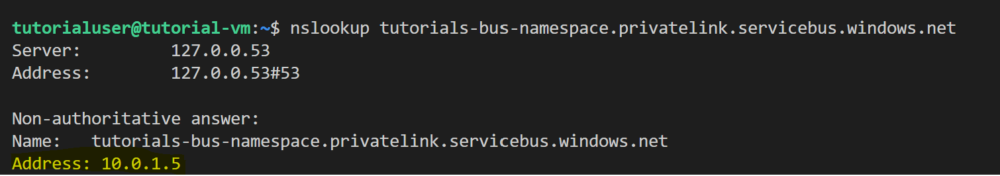

## Section 2- VM Setup (~4 min)

In Section 1, we focused on setting up our infrastructure via Terraform and explaining the cloud networking concepts that keep our application messages secure. This section is focused on preparing our created virtual machine to hold our applications. 

### Verify Private Link 

Start by verifying that our virtual machine can access the service bus successfully via the DNS record we created in Terraform.

```
nslookup tutorials-bus-namespace.privatelink.servicebus.windows.net
```

The lookup should return the service bus FQDN with an address prefixed in `10.0.x.x`, indicating that the VM can successfully resolve the domain of the service bus. 



### Install Python 3.8

Both our applications are written in Python and dependent on modules introduced in version 3.8. Run the following commands in order to install python 3.8 and replace the `python` alias with our newly installed one. 

```
sudo apt update 
sudo apt install software-properties-common
sudo add-apt-repository ppa:deadsnakes/ppa
sudo apt install python3.8
sudo update-alternatives --install /usr/bin/python python /usr/bin/python3.8 1

```

Afterwards, you should verify the python version command returns `3.8.16`.

```
Python -V
```

### Install Related Tools

Install the Python package manager `pip` and then upgrade it. 

```
sudo apt install python3-pip 
python -m pip install --upgrade pip 
``` 

And then install the Azure Python packages necessary to run our apps.

```
python -m pip install azure.core
python -m pip install azure.servicebus
```

### Build the Sender Application

Create a blank file titled `publish-message.py` .

```
touch publish-message.py
```

In a separate terminal window, copy the contents of `src/publish-message.py` in the root repository. Paste those contents into the above file created on the virtual machine.

Afterwards, fill in the variable `NAMESPACE_CONNECTION_STR` with the value in the `conn` file we created from our Terraform output. This connection string is a sensitive value that allows us to connect to our application to authenticate with the Service Bus. 

In the code, we:

- Import the necessary libraries, including `asyncio`, `ServiceBusClient`, and `ServiceBusMessage`.
- Define the `send_message` function, which creates a `ServiceBusMessage` object with the message content and sends it to the Service Bus topic 
- Define the `run` function, which:
  - Creates a `ServiceBusClient` instance using the connection string.
  - Obtains a `topic_sender` from the client for the specified `TOPIC_NAME`.
  - Calls the `send_message` function to send the message to the Service Bus topic.


The **asyncio** package is used for best practice. In a typical use case, an application may be sending hundreds or thousands of messages to the service bus. The package allows us to manage concurrent messages without blocking other tasks and requests.


### Build the Receiver Application

Create a blank file titled 'receive-message.py`.

``` 
touch receive-message.py
```

Similar to the step for `publish-message.py`, copy the contents of `src/publish-message.py` in the root repository. Paste those contents into the above file created on the virtual machine.

Afterwards, fill in the variable `NAMESPACE_CONNECTION_STR` with the value in the `conn` file we created from our Terraform output. 

In the code, we:

- Import the necessary libraries 
- Define the `run` function, which:
  - Creates a `ServiceBusClient` instance using the  connection string.
  - Obtains a `subscription_receiver` from the client for the specified `TOPIC_NAME` and `SUBSCRIPTION_NAME`.
  - Sets a `max_wait_time` of 5 seconds for receiving messages and a `max_message_count` of 20 messages to be received in one batch.
  - Iterates through the received messages, printing their content, and acknowledges the reception by calling `complete_message` for each message.

After pasting the contents into both scripts, continue to [**3-Run-and-Verify**](/lab/3-Run-and-Verify.md).