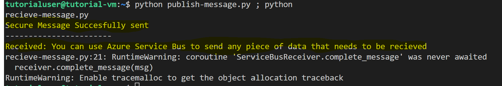
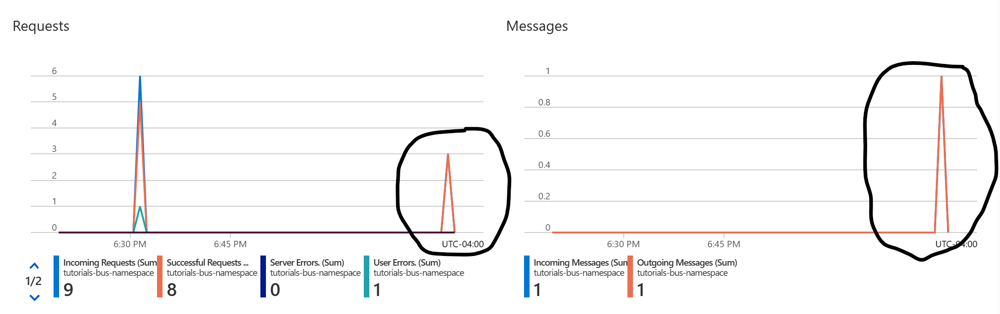

## Section 3: Run and verify applications (~1 minute)

Section 2 was primarily setting up our virtual machine to run our applications, and walking through both the sender and receiver application code. In this section, we'll run our newly created apps and verify that our system is working correctly in the portal. 

### Running Our Applications 

Inside the VM, run both scripts in the same line.

```
python publish-message.py ; python receive-message.py

```

A successful output is shown below. In it, the sender application confirms that it's sent the message to the service bus, and the receiver application follows up by posting the message on the topic it's subscribed to. 



### Verifying in The Portal

Open the Azure portal and navigate to the following path.

```
Service Bus > tutorials_bus_namespace > topics > overview
```
The Overview screen in the Azure Portal displays the number of requests and messages. You should observe two distinct and recent spikes, corresponding to the sender and receiver applications communicating with each other. It's important to note that, typically, a Service Bus allows you to view messages sent over an HTTPS connection within the user interface. However, because we're utilizing a private endpoint, the contents of the messages are not visible even within the Azure Portal UI. This further demonstrates the enhanced security provided by private endpoints.




Finally, it's time for cleanup. Continue to [**4-Cleanup**](/lab/4-Cleanup.md).